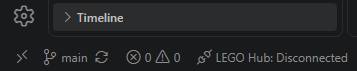
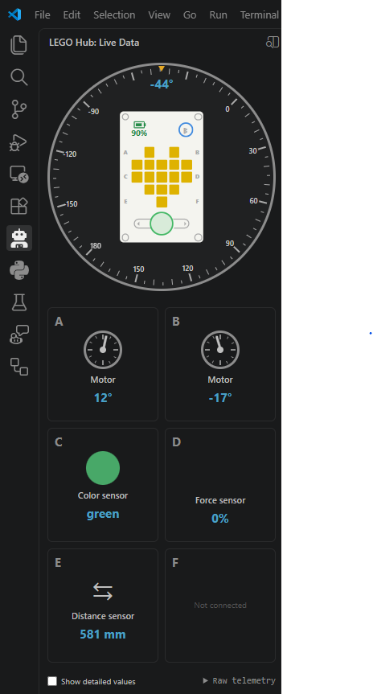
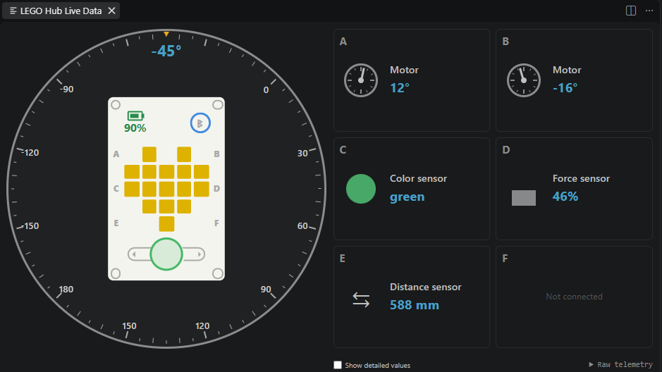

# LEGO SPIKE Prime / MINDSTORMS Robot Inventor Extension

This extension helps you connect to the SPIKE Prime or MINDSTORMS Robot Inventor brick and perform various operations on it.

> [!IMPORTANT]  
> Starting with version 2.x of the extension it will work ONLY with HubOS3. If you are running on the legacy HubOS2, please use the 1.x version and disable auto-updates for the extension.

## Features

### Connect to a hub

The extension supports Bluetooth and USB connections. By default, the hub picker searches both transports together and updates as hubs are discovered. Hub names and addresses make it easier to distinguish multiple nearby hubs. The extension can also reconnect to the last hub when VS Code starts.

The status bar shows the current connection state:



Select the status item to connect, or to disconnect when a hub is already connected. Use **LEGO Hub: Set Hub Name** from the Command Palette to rename the connected hub.

### Run and upload programs

When a Python editor is active and a hub is connected, the editor title provides controls for programs on the hub and for the current file:


- **Play** runs a program that is **already stored on the hub**. It prompts for the slot to run; it does not upload the current editor file.
- **Stop** terminates the program currently running on the hub.
- **Upload Program** (the refresh symbol) uploads the current Python file. Without a valid slot in a `# LEGO` header, the extension prompts for the destination slot. With a valid header, it uses the declared slot and runs the uploaded program when `autostart` is present.
- **Show Log Terminal** opens the persistent terminal for program output and extension messages.
- **Add File Header** helps create the slot and autostart header described below.

The default keyboard shortcuts apply only while a hub is connected and the active Python file begins with `# LEGO`:

| Shortcut   | Action                                                                                              |
| ---------- | --------------------------------------------------------------------------------------------------- |
| `F5`       | Upload the current file using its header; run it after upload when the header includes `autostart`. |
| `Shift+F5` | Stop the program currently running on the hub.                                                      |

These scoped shortcuts replace the normal Python debug actions only for connected LEGO program files.

### Live Data

The **LEGO Hub: Live Data** view displays live telemetry from the connected hub: battery level, Bluetooth state, hub orientation, motor positions, and values from color, force, distance, and matrix devices. The dashboard adapts to the available width, supports optional detailed values and raw telemetry, and marks ports without connected devices.

Use the LEGO Hub activity-bar view for a compact vertical layout:



Use the **Open Live Telemetry in Editor** button in the view title for a wider editor panel:



The update rate is controlled by `legoSpikePrimeMindstorms.telemetryInterval`.

### Start a stored program

The **LEGO Hub: Start Program** command runs code that is already stored in the selected hub slot:


### Preprocessor

To support multi files before the compilation (or upload if not compiled) imported files will be inserted in the current python script.
At the moment only

```python
from file_name import *
```

is supported. Files not found are skipped (in the hope they exist on the hub). Nevertheless an error will inform you.

> [!NOTE]  
> This is not supported for web extension usage.

### Custom Preprocessor

The plugin has a settings where you can specify an external program/script that should be executed before uploading the program
to the hub. This will receive the contents of the file as stdin. It should output the resulting file contents to stdout and exit the process with `0`.

> [!NOTE]  
> This will be executed AFTER the builtin preprocessor for combining the files and right before compiling and uploading the program to the hub!

> [!NOTE]  
> This is not supported for web extension usage.

### Raw Message Logging

For protocol debugging and test capture, enable `legoSpikePrimeMindstorms.logRawMessagesToFile` and reload the extension. The LEGO Hub terminal reports the generated `.jsonl` file in the extension log directory. Each line contains an ISO timestamp, direction (`in` or `out`), transport, and the complete COBS frame as hexadecimal data.

### Compilation

The extension supports compiling Python files to binary (MPY) before uploading. This is controlled by a setting:


### HubOS3 IntelliSense

The extension installs Pylance and configures its bundled HubOS3 type stubs for Python autocomplete, signatures, hover information, and import checking. No Python package or virtual environment is required. Set `legoSpikePrimeMindstorms.enableHubOS3Stubs` to `false` to disable this integration.

This feature requires the desktop extension host because Pylance cannot index extension files through a browser URI.

## Automatic upload/start of a Python file

During active development, you can avoid repeated slot and autostart prompts by placing a LEGO header on the first line of the file:

```python
# LEGO slot:<0-19> [autostart]
```

For example, this uploads the current file to slot 5 and starts it after the upload completes:

```python
# LEGO slot:5 autostart
```

Without `autostart`, **Upload Program** uploads the file to the declared slot but does not run it. The header must begin at the first character of the first line and uses uppercase `LEGO`.

## Credits

Thanks to [Peter Staev](https://github.com/PeterStaev), the original author of this extension, and to [pablomatisch](https://github.com/Pablomatisch) for the initial live telemetry support.

Thanks to LEGO Group to publish [extensive docs](https://lego.github.io/spike-prime-docs/index.html) on how to work with the HubOS protocol.

The bundled HubOS3 type stubs are adapted from [spike3-stubs](https://github.com/Pablomatisch/spike-prime-v3-stubs) by pablomatisch and cross-checked against [LEGO SPIKE Python v3 docs](https://github.com/jvolkening/lego-spike-python-v3-docs) by Jeremy Volkening. Both sources and the official LEGO Education API documentation are credited in [python-stubs/NOTICE.md](python-stubs/NOTICE.md).

## Disclaimer

_LEGO and MINDSTORMS are registered trademarks of the LEGO Group. SPIKE is trademark of LEGO Group._
